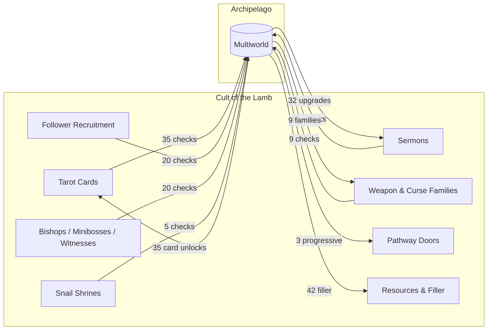

# Check Economy

The game-design view of the world: for each game system, **how much goes out** (locations —
things the player does that send a check) versus **how much comes in** (items — things
Archipelago grants back), and **what gets rerolled** between seeds and between runs.

`architecture.md` says how systems are hooked. `sprints/README.md` says what order to build
them in. This doc says what shape the *seed* is, which is the thing neither of those answers.

All counts come from generating a default seed against a local Archipelago checkout and
counting what the multiworld actually holds — not from adding up the tables in
`items.py`/`locations.py`, which overcount, and not from prose that can drift. Re-derive them
rather than trusting this file if it looks stale.

Current as of Sprint 0d (weapon and curse pools), which turned §3 below from a list of
reserved item ids into the world's second real two-sided system.

---

## The two-sided rule

A system can participate in Archipelago three ways, and the choice is a design decision, not
a technical one:

| Shape | Meaning | Feels like |
|---|---|---|
| **Two-sided** | The system both sends checks and receives its own unlocks | The system is *randomized* — you still play it, but you no longer choose what you get |
| **Outgoing only** | The system sends checks, receives nothing back | The system is a *faucet* — it pays other worlds and is never gated itself |
| **Incoming only** | The system receives items, sends nothing | The system is a *sink* — it's the reward surface, and its own activity is invisible to AP |

A world made only of faucets is a checklist. A world made only of sinks has nothing to do.
The interesting systems are two-sided, and the balance below is roughly the point.

---

## Where the seed's mass actually sits

Default base-game seed, every toggle on, `starting_tarot_cards: 8`, `starting_weapons: 1`,
`starting_curses: 1`. **Out** is locations actually created, not entries in `location_table` —
a family or card the player starts with gets neither a check nor an item, so it appears in
neither column:

| System | Out (locations) | In (items) | Shape | Ratio |
|---|---:|---:|---|---|
| Tarot cards (unlocks) | 19 | 35 | two-sided | 1 : 1.8 |
| Tarot cards (shop slots) | 16 | — | outgoing | — |
| Sermon upgrades | 32 | 32 | two-sided | **1 : 1** |
| Weapon families | 5 | 5 | two-sided | **1 : 1** |
| Curse families | 4 | 4 | two-sided | **1 : 1** |
| Bishops / minibosses / Witnesses | 20 | — | outgoing | — |
| Follower recruitment milestones | 20 | — | outgoing | — |
| Snail shrines | 5 | — | outgoing | — |
| Pathway doors (region access) | — | 3 | **incoming** | — |
| Resources / filler / traps | — | 42 | **incoming** | — |
| **Total** | **121** | **121** | | |

With Woolhaven: 147 / 147 (sermons 38, cards 54, weapons 6, filler holds at 42).

The two tarot rows are one system split by where its checks live; taken together it is 35 out
and 35 in, because a shop card's location is its shop slot rather than a `Tarot Card - X`
unlock. Three things fall out of the table.

**Three systems are now perfectly balanced**, and none of them by accident. Sermons:
`locations.py:67` and `items.py:sermon_item_counts` are both derived from the same
`SERMON_UPGRADES` list under the same DLC predicate. Weapons and curses: `regions.py` creates
a location per non-starting family and `create_items` adds an item per non-starting family,
both from the same `world.weapons`/`world.curses` pick made once in `generate_early`. In all
three cases the two sides are 1:1 *by construction* and can't drift. Every future collection
should copy that, because the alternative is a count mismatch that only shows up as a
generation failure.

**Filler is 35% of the pool** (42 of 121), down from 37.5% (42 of 112) before Sprint 0d. Note
that the absolute filler count did not move — 0d added 9 locations and 9 items, so it diluted
the share without displacing anything. That is the shape to aim for: a faucet-only sprint raises
the filler share, and filler is the least interesting thing a player can receive. Sprint 0c
doesn't change the ratio, but it makes the 35% much better, which is why it's early.

**Progression went from 3 items to 12.** Sprint 0d's weapon and curse items are the world's
first `progression` items that aren't region access — see §3 below, which is the biggest
change to this document's picture since it was written.

---

## Per system

Ordered as sketched, and annotated with what's real today.

### 1. Tarot cards — the flagship two-sided system

The largest system that works in both directions, and the template for the collections that
followed it.

- **Out**: 27 card-unlock locations in the table (5 region-gated, in `TarotCardRegion`), of
  which 19 are created once the 8 starting cards are dropped, + 16 shop-slot purchases.
  35 checks, still the largest single block.
- **In**: 35 card items (43 poolable minus 8 starting). Every card the player doesn't start
  with is somebody's item.
- **Withheld, not just tracked.** `TarotService` revokes the vanilla defaults on connect and
  keeps a shadow set; the card is genuinely unusable until AP grants it. This is what makes
  the system *feel* randomized rather than annotated.
- Cost of that: revoke/restore, a persistence store, and a `Tick()` sweep to survive the
  game's re-seed. `ManagedCollection` exists so the next collection doesn't pay it again.

Notably, the shop slots are outgoing-only *on purpose* — a card sold in a hub shop gets no
second unlock location, because buying it is the only route the game has, and the client
withholds the unlock anyway. Paying twice for one card would be double-counting.

### 2. Sermons — the balanced reference

38 upgrades (32 base + 6 Woolhaven), 1:1 both directions, 3 progressive chains.

The reason it's clean is the hook, not the data: `SermonUpgradePatch.PlayerUpgrade_Prefix`
returns `false` and replaces the whole reward step. No Disciple Point, no tree menu, no
pick — the check fires and the upgrade arrives only as an AP item. **Where a system has a
single reward method, patch that** rather than reaching for the managed-collection machinery.

Locations are deliberately sequential (`Sermon Upgrade N`) rather than named: filling the bar
is one repeatable event, and *which* upgrade you'd have chosen is precisely what AP is
randomizing away.

### 3 & 4. Weapons and curses — the world's progression backbone

**Sprint 0d landed, and it went two-sided rather than the sketch's incoming-only.** Six weapon
families and five curse families in a base-game seed (seven weapons with Woolhaven's Flail),
minus whatever the player starts with — so the default seed is 5 + 4 checks and 5 + 4 items.

The design detail that matters to this document is that **these twelve items are
`progression`, and the checks are gated on them** — `rules.set_equipment_rules` writes
`state.has("Apostate's Cleaver")` onto `Weapon - Apostate's Cleaver`. That isn't a judgement
about power, it's the classification rule this world applies everywhere: an item is
progression only when a rule names it, and until Sprint 0d nothing but region access
qualified. The gate is real rather than approximated because the client **filters what the
game is allowed to offer** instead of writing to `WeaponPool`/`CursePool` — until the item
arrives, no podium, chest or choice room in the game will ever put that family down, so the
check genuinely cannot fire. See
[`sprints/sprint-0d-equipment-pools.md`](sprints/sprint-0d-equipment-pools.md) for why
filtering beat the revoke-based `ManagedCollection` approach.

Consequences for the seed shape, in rough order of importance:

- **Progression goes from 3 items to 12** (13 with Woolhaven), and the nine new locations run
  on real logic rather than depth bands. They skip `set_depth_rules` entirely — `set_rule`
  overwrites rather than composes, so a location gets one or the other, and the item
  requirement is the true one.
- **The rules self-lock**, which the fill handles natively: *Apostate's Cleaver* can't be
  placed on its own location, because reaching it requires already holding it.
- **Sphere 1 didn't grow.** Measured on a default seed: 27 reachable locations of 121, the
  same 27 as before 0d added nine. Every new location is behind its own item.
- Weapons and curses are **independent toggles**, so a seed can be two-sided on one and have
  neither side on the other.

`legendary_weapons` rides alongside but is **not part of the economy at all** — no check, no
item, no change to the counts. It only swaps a granted family's normal weapon for its
Legendary on the podium, at 0/10/25/100%, and is forced to 0 without Woolhaven.

Still declared but unpooled: the two relics (`Beads of the Anchorite`, `Clauneck's Mirror`)
and the `Doctrine Unlock` / `Structure Unlock` placeholders are in `item_table` and the item
groups, but [`create_items`](../worlds/cult_of_the_lamb/__init__.py#L200-L239) never adds
them. Reserved ids, not content.

Hazard that shaped the options: a zero-length pool crashes (`GetRandomWeaponInPool` ends with
`list[0]` on a possibly-empty list), which is why `starting_weapons`/`starting_curses` have
`range_start = 1` and the client's substitution rule has a hardcoded Sword/Fireball fallback.

### 5. Follower acquisition — pure faucet

20 recruitment milestones, counted as "ever recruited" so a plague can't retroactively
unreach one. No items come back.

This is the clearest faucet in the world, and it's deliberately in the deep/excluded bands:
AP treats reachable as achievable, so a grind milestone must never hold someone's key item.
`rules.set_depth_rules` marks the deepest band `EXCLUDED` for exactly this.

If followers ever want an incoming side, the lever exists — `Follower Level Up` is already
a filler item, and follower levels are set directly by the interaction rather than by an XP
curve, so there's a single place to write.

### 6. Pathway doors — pure sink, and the entire progression graph

3 `Progressive Bishop's Domain` items. No locations at all.

**These 3 items are the world's only progression items that gate anything but themselves.**
Sprint 0d took the count from 3 to 12, but the nine weapon and curse items each unlock
exactly one location — their own — so they add spheres without opening any *other* content.
Everything else — every sermon upgrade, every tarot card — is `useful`. Region access is
still the only thing whose arrival changes what the rest of the seed can reach, which is why
the roadmap's top items are all sphere sources.

Which region is free at start, and the order the other three open in, is decided **per seed**
in `generate_early` and shipped to the client via `regionOrder` in slot data.

Unlocking a door and *keeping others shut* are separate problems — vanilla
`Interaction_BaseDungeonDoor.OnInteract()` never consults `UnlockedDungeonDoor`, so the
locking side needs its own prefixes. Worth remembering before assuming any other "unlock"
write is sufficient on its own.

### 7. Divine inspiration — the best unbuilt sphere source

Not started (Sprint 0e). Two independent YAML axes, every combination legal: tree layout
(`true_random` / `random_except_first` / `default`) crossed with AP interaction
(`checks_only` / `checks_and_points` / `checks_and_techs` / `off`).

Why it matters to this doc specifically: **tier gating is a cumulative count, not a
prerequisite graph** (`UpgradeTreeNode.cs:296` — a node needs
`NumUnlockedUpgrades() >= NumRequiredNodesForTier(tier)`, counting upgrades unlocked
anywhere). That is `Tier N reachable ⟺ count >= K_N` — six clean spheres from the game's
own rule, which beats the depth bands because it isn't an approximation of anything.

One combination is genuinely problematic and shouldn't be papered over:
`checks_and_points` can't support per-upgrade logic, because the player still picks what a
point buys, so AP never knows which techs they hold. Resolve it as a stated option
interaction or forbid it.

### 8. Constructing buildings — the strongest available artificial gate

Not started (Sprint 7). ~85 base-game real buildings, collapsing to ~45–50 once `_2`/`_II`
tier families fold into a check on their first tier.

The sizing question is the whole design: 85 locations would nearly double a 121-location
seed, which is the "extends rather than enriches" trap the 4–6 hour target exists to avoid.
Collapsed to ~45–50 with upper tiers as progressive *items*, it's two-sided and roughly
balanced instead of a 85-wide faucet.

Sequenced after Divine Inspiration because `StructuresData.GetUnlocked(TYPES)` maps every
buildable to an `UpgradeSystem.Type` — **the tree already gates what you can build**, so
structure checks land on top of tree logic rather than beside it.

### 9. Misc filler and resources — pure sink, 35% of the pool

7 filler names, weighted (`items.py:item_pool_weights`), plus a single `Dissent Trap` rolled
per item at `trap_percentage` (default 5%) rather than carved as an exact slice, so the trap
count varies between seeds.

Rolled per item, weighted toward resources, with `Follower Level Up` rarest because it
compounds. Two of the names currently lie about their effect ("Fervour" grants Coins,
"Gold Tithe" grants Gold Nuggets) — Sprint 0c fixes that at the root by taking names from
`WorldManipulatorManager.GetLocalisation` on the effect actually fired.

---

## The other axis: what rerolls, and when

The sketch's second question. Three different scopes, often confused:

| Scope | Decided | Examples |
|---|---|---|
| **Per seed** | Once, at generation | Region order and which region is free; which 8 tarot cards you start with; which weapon and curse families you start with; every item placement; trap count |
| **Per run** | Every crusade, by the game | Room layout, enemy rosters, which tarot cards are offered from the *unlocked* pool, weapon/curse draws from the *granted* families |
| **Per offer** | Every podium, chest or choice room | Whether a granted family's weapon is upgraded to its Legendary (`legendary_weapons`) |
| **Never** | Fixed game content | Bishop↔region pairings, miniboss rosters, hub shop stock, sermon tier order |

The load-bearing distinction: **Archipelago controls the pool, the game controls the draw.**
AP decides *which* tarot cards you may ever see; the game still rolls which of them appears
in a given crusade. Sprint 0d shipped the same deal for weapons and curses — AP gates which
families are eligible, `GetRandomWeaponInPool` still rolls per run and the client only
filters its answer. It does that from a postfix precisely to keep the game's own draw logic
(legendary gating, the Fervour lockout, `ForcedStartingWeapon`, the Cowboy fleece branch)
intact rather than reimplementing it.

The "Per offer" row is new with 0d and is worth keeping distinct: it's a gameplay modifier
that touches neither the pool nor the seed, so it can be changed without regenerating.

The "Never" column is the one worth attacking. Every seed currently plays the same four
regions with the same enemies, and `region_access_order` shuffles which door opens, never
what's behind it. Sprint 3b moves crusade content from "Never" to "Per seed" with no new
locations, no new items, and no added run time — pure enrichment, which is exactly what the
4–6 hour target asks for.

---

## Open design questions this view surfaces

1. **Twelve progression items in 121 locations, but only three of them gate anything else.**
   Sprint 0d improved the count without changing the underlying problem: depth bands are
   still the approximation standing in for real gates on the sermon, follower, snail and
   tarot blocks. Crown abilities (Sprint 1) and Divine Inspiration's count-based tiers
   (Sprint 0e) are still prioritised on this argument.
2. **Relics, doctrines and structures are declared but unpooled.** Weapons and curses left
   this list with Sprint 0d; the other four ids didn't. Either pool them or drop them — right
   now the `Relics` item group advertises content no seed contains.
3. **Every faucet added without a matching sink raises the filler share.** 0d is the
   counter-example worth copying: nine locations and nine items, so the filler count held at
   42 and its share fell. Buildings at 85 faucet-only locations would push it back past half.
4. **Sizes are re-derivable, so don't trust prose.** All counts here were produced by
   generating a default seed against a local Archipelago checkout, not by adding up tables —
   `location_table` has 131 base-game entries, but a default seed creates 121 of them, because
   starting cards and starting families get neither a check nor an item.
